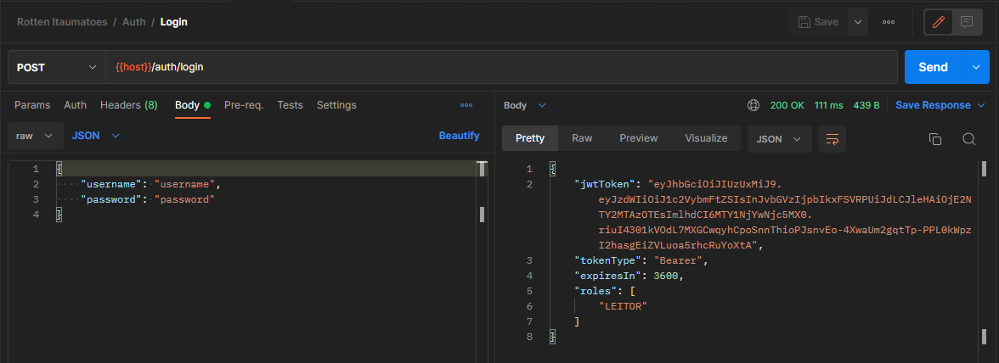
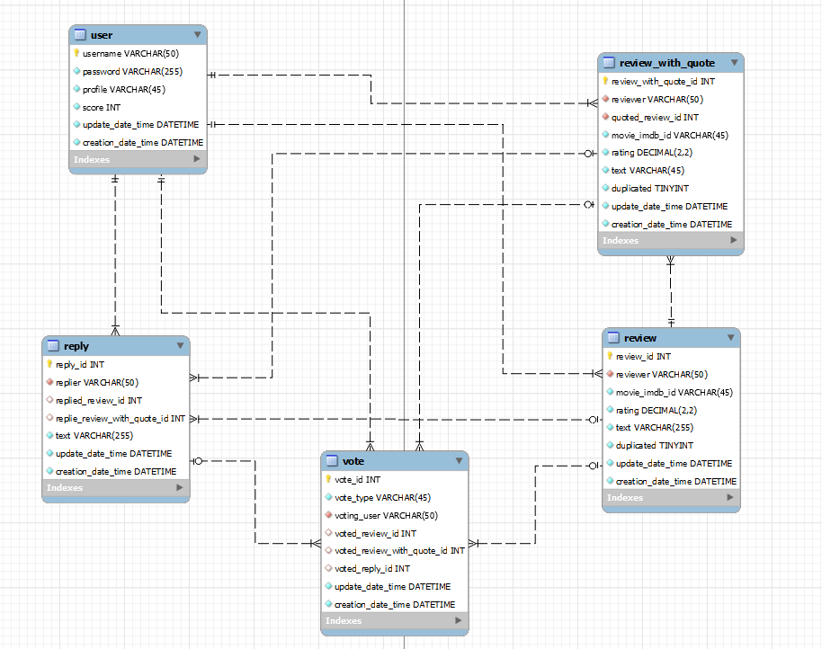

# rotten-itaumatoes

Esse projeto foi feito para a etapa de Coding Challenge do Bootcamp Itaú Dev Experts.  

O projeto consiste em criar uma API de críticas de filmes e séries, com alguns requisitos especificados [neste documento](https://drive.google.com/file/d/1Y6QpY6XC0s0OZMEOv3Tsehy3YGnVlOnd/view).

Um desses requisitos é consumir uma API externa de filmes, a [OMDb API](https://www.omdbapi.com/), criando as críticas a partir das informações que ela retorna.  

Cada usuário tem um perfil que depende de seu score, e conforme seu perfil e seu score evoluem, mais privilégios e permissões ele tem.  Vamos entrar em mais detalhes sobre esses perfis e o que cada um pode fazer quando explicarmos a lógica e o funcionamento da aplicação.  

Além da especificação de requisitos, temos uma pasta no drive contendo alguns recursos para testar e entender melhor nossas APIs, temos uma [collection](https://drive.google.com/file/d/1HsGDW8TzF_dAqOoCfQgIxeQlygDJIOc0/view?usp=sharing) e um [environment](https://drive.google.com/file/d/1DrPIerq_D8JG7UY1VguVWuTujOEGiJVe/view?usp=sharing) no Postman, o [MER da aplicação](https://drive.google.com/file/d/1GRP9SBJhrBBYd9G4rFGdWMYYHrquvxRH/view?usp=sharing) e outros recursos que podem te auxiliar.   

Caso não queira usar o Postman, também configuramos o Swagger na aplicação, que pode ser acessado através do seguinte endereço: http://localhost:8080/swagger-ui/

## Como rodar o rotten-itaumatoes

No ambiente local foram utilizados Java 11, e as últimas versões das imagens do MySQL e Redis no Docker.

A princípio, para fazermos o rotten-itaumatoes rodar, precisamos apenas de uma instância do MySQL de pé (a porta e o host podem ser configurados nas propriedades da aplicação).  

Sobre as tabelas e definições de dados, deixamos essa responsabilidade para a própria aplicação, então não há com o que se preocupar em criar a base de dados ou qualquer coisa do tipo, o rotten-itaumatoes já fará todo esse processo (desde que o user tenha as permissões necessárias).  

Para conseguirmos testar suas funcionalidades, temos alguns passos a mais (como o [**auth-server**](https://github.com/trepudox/auth-server)), mas vamos começar mostrando do que precisamos para rodá-lo.  

### MySQL com Docker

Como dito anteriormente, precisamos de uma instância do MySQL de pé para podermos usar o banco de dados da nossa aplicação.  

Então caso já tenha o MySQL configurado e funcionando na máquina, seria necessário apenas verificar o usuário nas configurações da aplicação (application.yml), e então partir para a seção de [configuração do auth-server](https://github.com/trepudox/rotten-itaumatoes#configuração-do-auth-server).  

Esta seção serve para mostrar como usar o MySQL com o Docker, sendo necessário apenas ter o Docker funcionando na máquina, o resto explicamos aqui.  

Com o Docker rodando, a primeira coisa que devemos fazer, é baixar as imagens do Docker Hub para a nossa máquina.  

Usando o PowerShell (ou qualquer outro console que te atenda) rode o seguinte comando:  

``
docker pull mysql
``

Dessa maneira, já temos a imagem do MySQL para criarmos a instância que precisamos para nossas aplicações.  

#### Container do MySQL

Para criar um container do MySQL, devemos rodar o seguinte comando:  

``
docker run -e MYSQL_ROOT_PASSWORD=root -dp 3306:3306 -it mysql
``

Onde temos algumas flags, que são importantes dependendo do que queremos.

A flag `-e` serve para definir uma variável de ambiente, então estamos definindo que a senha *root* do MySQL no container será root.  

Já a flag `-dp` são duas flags acopladas, a `--detach` e a `--port`, usando `--detach` o container irá rodar em background, já a `--port` é para mapearmos as portas.  

A última flag, `-it`, é para tornar o container interativo, ou seja, conseguiremos acessar os arquivos do container, a bash e outros recursos dentro dele.

Após executar o `docker run`, o Docker criará um container e imprimirá 4 caracteres no console.  

Esses caracteres são o começo do **container ID**, precisamos dele para identificar o container.

Com o container ID em mãos, podemos interagir com o container (lembra da flag `-it`?).  

Então, rodando o seguinte comando conseguimos acessar o MySQL que está em execução dentro do container:

``
docker exec -it <containerID> mysql -uroot -p
``

Onde estamos informando que logaremos através do user **root** (pela flag `-uroot`) e que estaremos informando a senha para acessá-lo (pela flag `-p`).  

Só não se esqueça de alterar o `<containerID>` para o ID do seu container MySQL.

Dessa maneira já conseguimos acessar o MySQL do container e executar instruções dentro dele!

### Configuração do auth-server

Para podermos fazer cadastro e login no rotten-itaumatoes, precisamos configurar e rodar o [**auth-server**](https://github.com/trepudox/auth-server).  

Uma das etapas para fazê-lo funcionar é a configuração do MySQL que acabamos de fazer, mas também temos que configurar o Redis.  

**IMPORTANTE!**  

Para que o auth-server funcione corretamente precisamos rodar o rotten-itaumatoes ao menos uma vez, para que a base de dados e as tabelas sejam criadas.  

Então, inicie o rotten-itaumatoes, e depois configure o auth-server, dessa maneira tudo correrá bem.  

Recomendo também dar uma olhada na [documentação do auth-server](https://github.com/trepudox/auth-server#auth-server), lá há um passo da configuração do MySQL, do Redis, e uma explicação de como o serviço funciona.

### Primeiros passos

Para começar, devemos ter o MySQL, o auth-server e o Redis rodando (precisamos do Redis, já que ele é um requisito para o auth-server). Dessa maneira conseguiremos realizar o cadastro e login corretamente.  

A primeira chamada que devemos fazer é o cadastro, onde passamos o usuário e a senha, a senha será encriptografada antes de ser enviada.  

Após a criação do usuário, podemos efetuar o login, onde teremos uma resposta com o Bearer token a ser utilizado nas próximas chamadas.  

Caso tenha tido um retorno como este, significa que está tudo certo e que o **rotten-itaumatoes** e o **auth-server** estão funcionando corretamente!  

## Como o rotten-itaumatoes funciona

Com o rotten-itaumatoes já funcionando, já podemos partir para a execução e entrar nos detalhes das requisições e entidades. Vamos explicar como funciona, e como entendi os requisitos e desenvolvi o projeto.  

### Modelagem de dados e MER

A primeira coisa que procurei entender bem, foi como seria o modelo de dados. Considerando um usuário e diversas ações que ele pode ter, tive diversas ideias de como mapear as entidades.  

Acabei utilizando um banco de dados relacional, levando em conta que eu precisaria muito relacionar um dado ao outro.  

O MER ficou dessa maneira:  

Onde um usuário tem uma relação de **1:n** com todas as outras entidades.  

O MER pode ter ficado um pouco confuso, por conta do excesso de relacionamentos, mas foi a maneira que encontrei de mapear cada tipo de postagem que o usuário poderia ter.  

Onde é interessante notar que as entidades **reply** e **vote** possuem um relacionamento opcional com as entidades **review** e **review-with-quote**, e no caso do **vote**, também recebe opcionalmente uma **reply**.  

#### Mas o que são cada uma dessas entidades?  

**user** se refere ao usuário e seu perfil.

**review** seria a avaliação que o usuário pode fazer nos filmes, séries e episódios.

**review-with-quote** seria uma avaliação de um filme, séries ou episódio, mas citando uma OUTRA **review**.

**reply** se trata das respostas às reviews e reviews with quote.

E a entidade **vote** se trata das avaliações de cada **review**, **review-with-quote** ou **reply**. Cada **vote** é um like ou um dislike.  

#### E por que as entidades **vote** e **reply** podem receber as outras entidades como opcionais?

Optei por desenvolver dessa maneira, já que uma reply pode ser para qualquer uma das reviews (review e review-with-quote) e um like/dislike pode ser para qualquer uma das publicações (review, review-with-quote e reply).  

Então quando um registro de **vote** é criado na base, ele recebe apenas uma entidade, seja **reply**, **review** ou **review-with-quote**.  

O mesmo serve para a **reply**, quando a resposta é direcionada à **review**, o campo 'replied_review_with_quote_id' fica vazio, e vice versa.

Por mais que o banco de dados tenha esse dinamismo no relacionamento, a aplicação não permite que uma reply ou um vote possuam mais de uma postagem sendo referenciada.  

### Consumo da aplicação

Entendendo como as entidades funcionam, o consumo da aplicação se torna mais intuitivo, já que os nomes dos endpoints, no Postman, no Swagger e até mesmo no código, procuram relatar exatamente o que o método faz.  

Inclusive, recomendamos que utilize o Postman com a collection e o environment disponibilizados no [drive](https://drive.google.com/drive/folders/10NPwM96BjES6jWQZ8hBUmPdqFrtC3BDu), pois também há uma documentação para cada endpoint do projeto.  

Mesmo assim, gostaria de passar um pouco por eles, para clarear o máximo possível.

Os endpoints da categoria **Auth** servem para fazer o login e o cadastro. Ao enviar suas credenciais, a API criptografa a senha e envia ao auth-server, isso acontece tanto no login quanto no cadastro. Ao receber o token na resposta do login, só é necessário enviá-lo como Bearer em cada uma das requisições.  

Na categoria **User**, temos os endpoints de ver perfil e de conceder moderador. Onde no endpoint de ver perfil só é necessário enviar o token, que o perfil do usuário já será retornado.  

Nas categorias **Movies**, **Series** e **Episodes**, podemos buscar itens diretamente pelo seu nome ou pelo seu imdbID. Também podemos fazer uma pesquisa aos itens que não sabemos o nome exato.  

Temos só um pequeno adendo aos endpoints de **Episodes**. Decidi mantê-los na aplicação, mas dois deles não funcionam como o esperado por conta de algum bug na OMDb API. Temos o seguinte estado para cada endpoint:  

1. Funcionando:
   - `GET /episodes/imdb-id/{imdbId}`
2. NÃO funcionando:
   - `GET /episodes/title/{title}`
   - `GET /episodes/search/?title=`

A partir das informações que são retornadas pela OMDb API, um usuário consegue obter o imdbID do item (filme, serie ou espisodio) e já consegue criar uma **review**.  

Então, é aqui que a brincadeira começa de verdade, criando e manipulando reviews, replies e reviews-with-quote.

Temos a criação da review, onde passamos o imdbID do item que estamos avaliando, a nota e o texto. Ao criar uma review, o usuário ganha 1 de score.  

Podemos buscar uma review pelo seu ID ou todas as reviews de algum filme, serie ou episodio, pelo seu imdbID.  

Também temos um endpoint onde podemos definir uma review como duplicada ou não duplicada. Para este endpoint é necessário ser Moderador.  

Um outro POST que temos é o de avaliar uma review, seria o vote, o like ou o dislike. Passamos o ID da review e o tipo de voto que queremos (like ou dislike). O usuário precisa ser Avançado ou superior para acessar esse endpoint.

Devemos nos atentar ao campo `voteType`, que é um Enum na aplicação, e só aceitará as strings `"LIKE"` e `"DISLIKE"`.

Temos um PATCH para atualizar a review, onde podemos passar a nota, o texto, ou os dois parâmetros. Fica a critério do usuário. Para se atualizar uma review é necessário ser o dono da postagem.  

E por último temos a exclusão de uma review, ela é feita por ID e é necessário ser Moderador ou o dono da postagem para fazer isso.  

A lógica e as requisções das entidades review, review-with-quote e reply são bem parecidas, então creio que se torna redundante explicar cada endpoint. Mesmo assim, ainda gostaria de citar alguns pontos que podem trazer dúvidas.

Uma review with quote pode apenas referenciar uma outra **review**, e não outra **review with quote**. Então ao criar uma review with quote, certifique-se que o ID que está enviando é de uma review existente.  

Assim como o endpoint de avaliação das reviews e replies, temos um Enum que devemos nos atentar na criação de replies.  

O nome do campo é `reviewType` e os valores aceitos serão apenas `NORMAL_REVIEW` e `REVIEW_WITH_QUOTE`.

Relembrando que esses detalhes estão na documentação dentro do Postman, mas deixamos algumas explicações aqui também.  

Uma observação importante em relação à pontuação e perfil do usuário: Quando o perfil do usuário atingir o suficiente para evoluir, ele irá passar para o próximo perfil. Mas é necessário fazer o login novamente, para atualizar o token e obter as permissões do novo nível de perfil.

Espero que essa etapa de como consumir a aplicação tenha ficado clara, pode ter ficado breve, mas tentei apresentar apenas os pontos mais importantes, para também não se tornar muita informação. Bons testes!

## Ideias para o projeto

Mesmo com a aplicação funcionando corretamente e atendendo os requisitos, ainda quis implementar e mudar algumas coisas, que por alguma razão não consegui.  

Nessa seção do README estarei apenas dissertando algumas ideias que tive, e alguns motivos que tive para fazer a aplicação deste jeito.

### Planos de implementação

Uma das coisas que me deixou um pouco chateado de não conseguir fazer, foi a implementação de busca dos episódios. Creio que esse problema partiu principalmente da OMDB API, já que todos os testes que fiz com outros tipos de itens (como filmes e séries) funcionou corretamente.

Minha intenção era estressar os testes nesses endpoints de episódios para ver o que eu conseguiria tirar proveito.
Mas para poupar tempo preferi seguir no desenvolvimento das funcionalidades.   

Outro ponto (esse até me incomodou kkkkk) foi não ter tempo suficiente para criar testes unitários. Depois que se aprende a criar testes unitários e se consegue ver o quão bom é tê-los no seu código, fica difícil de seguir sem eles.

Mas por conta do tempo, foi outra implementação importante que decidi deixar de lado e focar na qualidade do código e testes manuais.

Uma outra ideia que tive, essa demandaria um pouco mais de tempo e esforço, seria criar um outro projeto, contendo as classes comuns entre o **rotten-itaumatoes** e o **auth-server**.  

Algo como um **rotten-itaumatoes-commons**, um projeto onde eu pudesse centralizar todas as classes comuns entre eles, já que temos muita coisa compartilhada entre os dois projetos.  

Seria um pouco trabalhoso, mas assim que ele fosse declarado no pom.xml dos dois projetos, tudo ficaria mais fácil.

Também senti falta de duas configurações que poderiam servir como qualidade de vida pra quem fosse testar a aplicação, customização de cada endpoint no Swagger, e um .SQL contendo a definição das tabelas e da base de dados.  

Talvez essas duas tarefas não demandassem tanto tempo, mas confesso que preferi não priorizá-las, já que havia muito a se fazer.  

Houveram também duas implementações que eu gostaria de ter alterado e refinado mais, uma é o tratamento de exceção, que não acho que esteja ruim, mas não acho que está ótimo. 
A outra melhoria seria o aprofundamento dos logs, senti que fiz o projeto com um pouco de pressa e não dei muita atenção para os logs.

### Arquitetura

Creio que muitos desenvolvedores hoje em dia se baseiam em conceitos, ideias, arquiteturas e métodos que são compartilhados na comunidade.  

Comigo não é muito diferente, gosto muito de estudar alguns conhecimentos como SOLID, Clean Code, Clean Arch e outros. 
Muito do que fiz nesse projeto (e também do que faço no meu dia a dia) carrega partes desses conceitos.

Considerei em dividir muito bem cada domínio do outro, penso que dessa forma as entidade possuem mais autonomia.  

Seria mais fácil quebrar esse microsserviço em outros microsserviços, já que como se pode ver, o projeto ficou bem grande e juntou muitas responsabilidades, ainda mais com a arquitetura escolhida e todas as camadas que decidi desenvolver.  

Essa seria uma ideia, outra ideia, que pensei durante todo o desenvolvimento, foi a criação de uma aplicação BFF (Backend for Frontend) para orquestrar todos as requisições e respostas que temos.  

Já que cada entidade ficou muito dissociada da outra, um Frontend precisaria realizar diversas chamadas para construir uma página só, algo que poderia onerar muito o cliente.  

Então uma solução viável seria criar uma aplicação BFF assíncrona, já que a maioria das requisições não dependem diretamente uma das outras.  

Um bom exemplo desse problema seria a construção de uma página com filmes e comentários.
Vamos pensar que o Frontend vá precisar das informações de um determinado filme, com suas Reviews, ReviewsWithQuote, Replies...

E assim por diante, acho que nesse exemplo já conseguimos entender que ficaria bem ruim pro front. 
Do jeito que está construído hoje, o frontend precisaria fazer uma requisição para cada um desses endpoints, e aguardar de maneira sincrona a resposta de cada um.  

Com um BFF assíncrono (usando WebFlux por exemplo) e com cada domínio possuindo um microsserviço para si (movies-service, reviews-service e etc) teríamos uma solução mais elegante e aplicável.  

Teríamos uma única chamada do Frontend, retornando todo o resultado que ele espera, de maneira centralizada e muito mais rápida.  

Considerei a criação do microsserviço de filmes por conta do tratamento da resposta da OMDB API, sinto que seria melhor ter um microsserviço especializado para isso, já que tive que fazer vários tratamentos sobre a resposta recebida.
Lógico que isso é só uma ideia, mesmo assim, segue o desenho de solução do que imaginei:  

