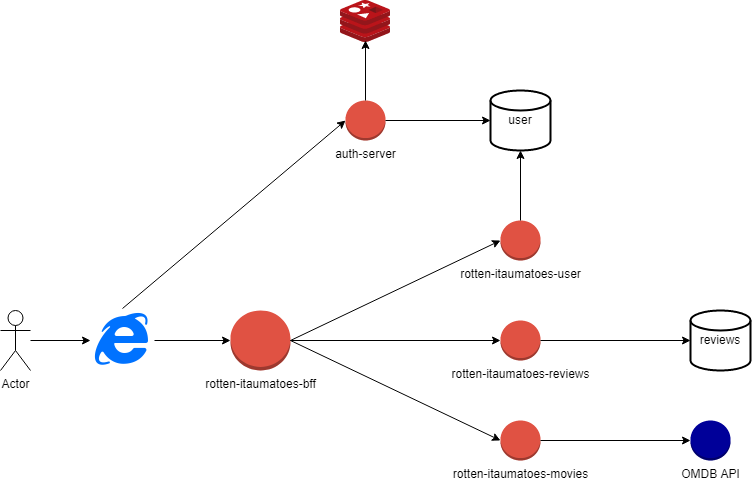

# Rotten-Itaumatoes

## Ideias para o projeto

Creio que muitos desenvolvedores hoje em dia se baseiam em conceitos, ideias, arquiteturas e métodos que são compartilhados na comunidade.  
Comigo não é muito diferente, gosto muito de estudar alguns conhecimentos como SOLID, Clean Code, Clean Arch e outros.  
Muito do que fiz nesse projeto (e também do que faço no meu dia a dia) carrega parte desses conceitos.  
Nessa seção do README estarei apenas dissertando algumas ideias que tive, e alguns motivos que tive para fazer a aplicação deste jeito.  

Considerei em dividir muito bem cada domínio do outro, penso que dessa forma as entidade possuem mais autônomia.  
Seria mais fácil quebrar esse microsserviço em outros microsserviços, já que como se pode ver, o projeto ficou bem grande e juntou muitas responsabilidades, ainda mais com a arquitetura escolhida e todas as camadas que desenvolvi.  

Essa seria uma ideia, outra ideia, que pensei durante todo o desenvolvimento, foi a criação de uma aplicação BFF (Backend for Frontend) para orquestrar todos as requisições e respostas que temos.  
Já que cada entidade ficou muito dissociada da outra, um Frontend precisaria realizar diversas chamadas para construir uma página só, algo que poderia onerar muito o cliente.  
Então uma solução viável seria criar uma aplicação BFF assíncrona, já que muitas requisições não dependem uma da outra.  

Um bom exemplo disso seria a construção de uma página com filmes e comentários.  
Vamos pensar que o Frontend vá precisar das informações de um determinado filme, com suas Reviews, ReviewsWithQuote, Replies...
Enfim, acho que deu pra entender, o Frontend faria uma requisição para cada um desses endpoints.  
Com um BFF assíncrono (usando WebFlux por exemplo) e com cada domínio possuindo um microsserviço (movies-service, reviews-service e etc) teríamos uma solução elegante e aplicável.  
Teríamos uma única chamada do Frontend, retornando todo o resultado que ele espera, de maneira centralizada e muito mais rápida.  

Considerei a criação do microsserviço de filmes por conta do tratamento da resposta da OMDB API, sinto que seria melhor ter um microsserviço especializado para isso, já que tive que fazer vários tratamentos sobre a resposta recebida.
Mas lógico, isso é só uma ideia, mas segue o desenho de solução do que imaginei:  

