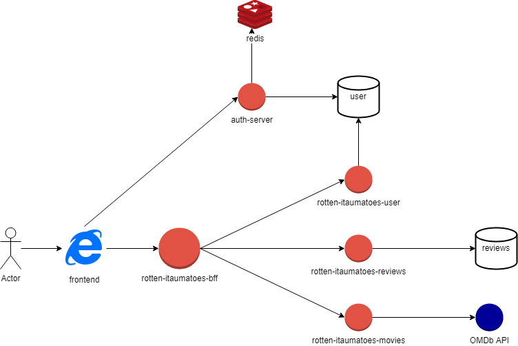

# rotten-itaumatoes

Esse projeto foi feito para a etapa de Coding Challenge do Bootcamp Itaú Dev Experts.  

O projeto consiste em criar uma API de críticas de filmes e séries, com alguns requisitos especificados neste [documento](linkdodrive).  

Um desses requisitos é consumir uma API externa de filmes, a [OMDb API](https://www.omdbapi.com/), criando as críticas a partir das informações dela.  

Cada usuário tem um perfil que depende de seu score, e conforme seu perfil e seu score evoluem, mais privilégios e permissões você tem.  Vamos entrar em mais detalhes sobre esses perfis e o que cada um pode fazer quando explicarmos a lógica e o funcionamento da aplicação.  

## Como rodar o rotten-itaumatoes

A princípio, para fazermos o rotten-itaumatoes rodar, precisamos apenas de uma instância do MySQL de pé (a porta e o host podem ser configurados nas propriedades da aplicação).  

Sobre as tabelas e definições de dados, deixamos essa responsabilidade para a própria aplicação, então não há com o que se preocupar em criar a base de dados ou qualquer coisa do tipo, o rotten-itaumatoes já fará todo esse processo (desde que tenha permissão).  

Para funcionar de fato temos alguns passos a mais (como o [**auth-server**](https://github.com/trepudox/auth-server)), mas vamos começar mostrando do que precisamos para rodá-lo.  

### MySQL com Docker

Como dito anteriormente, precisamos de uma instância do MySQL de pé para podermos usar o banco de dados da nossa aplicação.  

Então caso já tenha o MySQL configurado e funcionando na máquina, seria necessário apenas verificar o usuário nas configurações da aplicação (application.yml), e então partir para a seção de [primeiros passos](https://github.com/trepudox/rotten-itaumatoes#primeiros-passos).  

Esta seção serve para mostrar como usar o MySQL com o Docker, sendo necessário apenas ter o Docker funcionando na máquina, o resto explicamos aqui.  

### Primeiros passos

## Como o rotten-itaumatoes funciona

placeholder top

## Ideias para o projeto

# alguma coisa aqui antes pf Marco!!  
Nessa seção do README estarei apenas dissertando algumas ideias que tive, e alguns motivos que tive para fazer a aplicação deste jeito.

### Planos de implementação

Uma das coisas que me deixou um pouco chateado de não conseguir fazer, foi a implementação de busca dos episódios. Creio que esse problema partiu principalmente da OMDB API, já que todos os testes que fiz com outros tipos de itens (como filmes e séries) funcionou corretamente.

Minha intenção era estressar os testes nesses endpoints de episódios para ver o que eu conseguiria tirar proveito.
Mas para poupar tempo preferi seguir no desenvolvimento das funcionalidades.   

Outro ponto (esse até me incomodou kkkkk) foi não ter tempo suficiente para criar testes unitários. Depois que se aprende a criar testes unitários e se consegue ver o quão bom é tê-los no seu código, fica difícil de seguir sem eles.

Mas por conta do tempo, foi outra implementação importante que decidi deixar de lado e focar na qualidade do código e testes manuais.

Uma outra ideia que tive, essa demandaria um pouco mais de tempo e esforço, seria criar um outro projeto, contendo as classes comuns entre o **rotten-itaumatoes** e o **auth-server**.  

Algo como um **rotten-itaumatoes-commons**, um projeto onde eu pudesse centralizar todas as classes comuns entre eles, já que temos muita coisa compartilhada entre os dois projetos.  

Seria um pouco trabalhoso, mas assim que ele fosse declarado no pom.xml dos dois projetos, tudo ficaria mais fácil.

Também senti falta de duas configurações que poderiam servir como qualidade de vida pra quem fosse testar a aplicação, customização de cada endpoint no Swagger, e um .SQL contendo a definição das tabelas e da base de dados.  

Talvez essas duas tarefas não demandassem tanto tempo, mas confesso que preferi não priorizá-las, já que havia muito a se fazer.  

Houveram também duas implementações que eu gostaria de ter alterado e refinado mais, uma é o tratamento de exceção, que não acho que esteja ruim, mas não acho que está ótimo. 
A outra melhoria seria o aprofundamento dos logs, senti que fiz o projeto com um pouco de pressa e não dei muita atenção para os logs.

### Arquitetura

Creio que muitos desenvolvedores hoje em dia se baseiam em conceitos, ideias, arquiteturas e métodos que são compartilhados na comunidade.  

Comigo não é muito diferente, gosto muito de estudar alguns conhecimentos como SOLID, Clean Code, Clean Arch e outros. 
Muito do que fiz nesse projeto (e também do que faço no meu dia a dia) carrega partes desses conceitos.

Considerei em dividir muito bem cada domínio do outro, penso que dessa forma as entidade possuem mais autonomia.  

Seria mais fácil quebrar esse microsserviço em outros microsserviços, já que como se pode ver, o projeto ficou bem grande e juntou muitas responsabilidades, ainda mais com a arquitetura escolhida e todas as camadas que decidi desenvolver.  

Essa seria uma ideia, outra ideia, que pensei durante todo o desenvolvimento, foi a criação de uma aplicação BFF (Backend for Frontend) para orquestrar todos as requisições e respostas que temos.  

Já que cada entidade ficou muito dissociada da outra, um Frontend precisaria realizar diversas chamadas para construir uma página só, algo que poderia onerar muito o cliente.  

Então uma solução viável seria criar uma aplicação BFF assíncrona, já que a maioria das requisições não dependem diretamente uma das outras.  

Um bom exemplo desse problema seria a construção de uma página com filmes e comentários.
Vamos pensar que o Frontend vá precisar das informações de um determinado filme, com suas Reviews, ReviewsWithQuote, Replies...

E assim por diante, acho que nesse exemplo já conseguimos entender que ficaria bem ruim pro front. 
Do jeito que está construído hoje, o frontend precisaria fazer uma requisição para cada um desses endpoints, e aguardar de maneira sincrona a resposta de cada um.  

Com um BFF assíncrono (usando WebFlux por exemplo) e com cada domínio possuindo um microsserviço para si (movies-service, reviews-service e etc) teríamos uma solução mais elegante e aplicável.  

Teríamos uma única chamada do Frontend, retornando todo o resultado que ele espera, de maneira centralizada e muito mais rápida.  

Considerei a criação do microsserviço de filmes por conta do tratamento da resposta da OMDB API, sinto que seria melhor ter um microsserviço especializado para isso, já que tive que fazer vários tratamentos sobre a resposta recebida.
Lógico que isso é só uma ideia, mesmo assim, segue o desenho de solução do que imaginei:  

